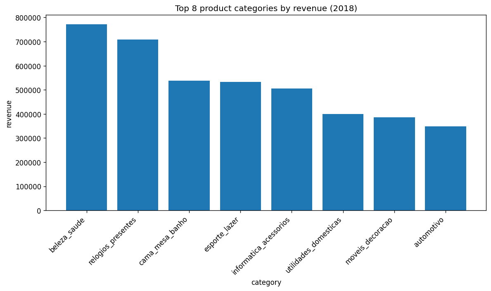
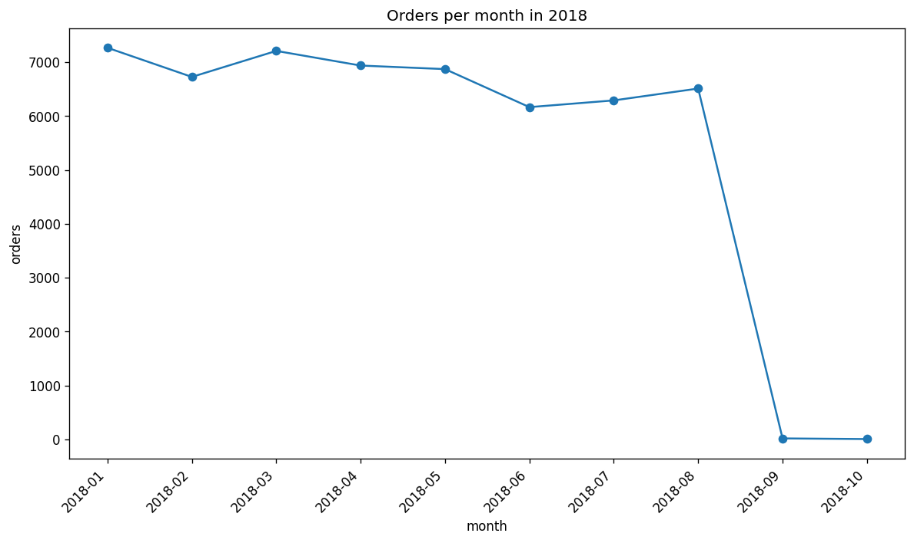
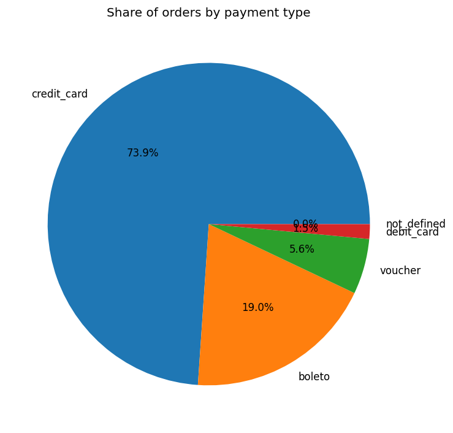
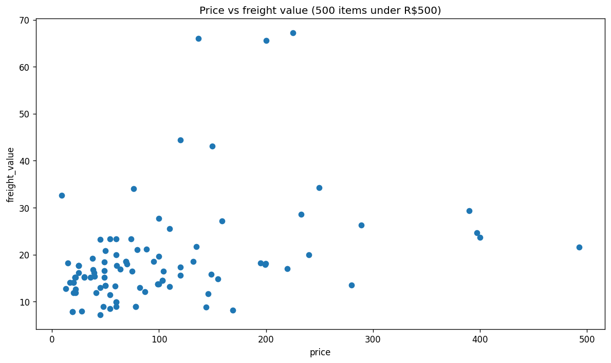

# Insight Agent

[](https://github.com/medsahbi10/insight-agent/actions/workflows/ci.yml)
[](https://www.python.org/downloads/)
[](LICENSE)

> A conversational data-analyst agent over a real Brazilian e-commerce warehouse.
> Ask in natural language, get English answers, SQL, and charts back.
> Built on LangGraph, served by open-weights models on Groq, traced with Arize Phoenix.

---

## Sample outputs

| Bar — top categories by revenue | Line — orders per month |
|---|---|
|  |  |

| Pie — payment types | Scatter — price vs freight |
|---|---|
|  |  |

Each chart is produced by the agent's `make_chart` tool at runtime.

---

## Example interaction

```
> Plot the top 8 product categories by total revenue in 2018 as a bar chart

[agent] -> get_schema()
[agent] -> make_chart(sql='SELECT p.product_category_name AS category, ...',
                      kind='bar', title='Top 8 product categories by revenue (2018)')
[tool]    Chart saved: charts/chart_xxxxxxxx.png. Bar chart of category vs revenue, 8 rows.
[answer]  Here is the bar chart you asked for. SQL used: ...
```

---

## Features

- **Schema-aware SQL agent** — introspects the warehouse, writes DuckDB SQL, self-corrects on errors via tool-result reflection
- **Defense-in-depth safety** — regex blocks `INSERT/UPDATE/DELETE/DROP/...` *and* connections open read-only
- **Multi-modal output** — `make_chart` tool renders bar / line / pie / scatter PNGs; Streamlit embeds them inline
- **Multi-agent variant** — Planner → Executor → Critic with bounded revision loop and sub-graph composition
- **Eval harness** — golden Q&A set + LLM-as-judge with Pydantic-structured scoring (91.7% baseline correctness on 12 questions)
- **Full observability** — every LLM call and tool invocation traced via Arize Phoenix (OpenInference / OpenTelemetry)
- **Production-shaped** — Dockerfile, docker-compose, GitHub Actions CI (ruff + pytest + image build)

---

## Tech stack

| Layer | Choice | Why |
|---|---|---|
| Agent framework | **LangGraph** | Explicit state machine; sub-graph composition; broad recognition |
| LLM | **gpt-oss-120B** (Apache 2.0) via Groq | Reliable structured tool calls, free tier, one-line provider swap |
| Database | **DuckDB** | Analytical, single-file, native CSV ingestion, sub-ms queries |
| UI | **Streamlit** | One-file chat UI with progressive trace + inline charts |
| Observability | **Arize Phoenix** | OTel-native, in-process server, sub-second trace UI |
| Charts | **matplotlib** | Headless `Agg` backend, four chart kinds in one tool |
| Eval | **Pydantic** structured output | Forced JSON schema → zero parsing brittleness |
| Container | **Docker** + **docker-compose** | Reproducible builds; CI validates the image |
| CI | **GitHub Actions** | Ruff lint → pytest → docker build, with remote-debug annotations |

---

## Dataset

[Olist Brazilian E-Commerce](https://www.kaggle.com/datasets/olistbr/brazilian-ecommerce) — ~100K real orders across 9 tables (orders, order_items, products, customers, sellers, reviews, payments, geolocation, category translations), 2016–2018, ~1.5M rows total.

---

## Quickstart

### 1. Install

```bash
git clone https://github.com/medsahbi10/insight-agent.git
cd insight-agent

python -m venv .venv
# Windows PowerShell
.venv\Scripts\Activate.ps1
# Linux / macOS
# source .venv/bin/activate

pip install -r requirements.txt
```

### 2. Configure

```bash
cp .env.example .env       # Windows: copy .env.example .env
# Paste your Groq API key (free at https://console.groq.com) into .env
```

### 3. Load the data

Download the 9 Olist CSVs from [Kaggle](https://www.kaggle.com/datasets/olistbr/brazilian-ecommerce) into `data/raw/`, then:

```bash
python scripts/load_data.py
```

~1.5M rows load into DuckDB in about 5 seconds.

### 4. Run

Three entry points — pick any:

```bash
# Single-agent CLI
python -m src.agent_cli "How many orders were delivered in 2018?"

# Multi-agent CLI (Planner → Executor → Critic)
python -m src.multi_agent_cli "Which 5 sellers had the highest revenue in 2018, and from which state?"

# Streamlit chat UI with inline charts + Phoenix tracing
streamlit run app.py
# → http://localhost:8501  (chat)
# → http://localhost:6006  (traces)
```

Or run the whole stack in containers (no local Python needed):

```bash
docker compose up --build
```

### 5. Evaluate

```bash
python -m src.evals_cli                  # single-agent baseline, all 12 questions
python -m src.evals_cli --agent multi    # multi-agent
python -m src.evals_cli --agent both     # side-by-side comparison
```

**Single-agent baseline**: 11 / 12 correctness (91.7%), 12 / 12 clarity (100%), avg 8.6 s/question.

---

## Project structure

```
insight-agent/
├── app.py                          # Streamlit chat UI
├── Dockerfile                      # python:3.12-slim with layer-cached deps
├── docker-compose.yml              # one-command dev stack
├── .github/workflows/ci.yml        # ruff → pytest → docker build
├── data/
│   ├── raw/                        # 9 Olist CSVs (gitignored)
│   └── duckdb/olist.duckdb         # built warehouse (gitignored)
├── docs/screenshots/               # README chart gallery
├── evals/
│   ├── golden.jsonl                # 12 hand-verified Q&A pairs
│   └── results/                    # eval run outputs (gitignored)
├── scripts/load_data.py            # CSV → DuckDB ingestion
├── src/
│   ├── db.py                       # DuckDB connection + schema helpers
│   ├── tools.py                    # get_schema, run_sql, safety regex
│   ├── charts.py                   # render_chart (PNG: bar/line/pie/scatter)
│   ├── llm.py                      # provider-agnostic ChatModel factory
│   ├── agent.py                    # single-agent LangGraph state machine
│   ├── agent_cli.py                # CLI for single-agent
│   ├── multi_agent.py              # Planner → Executor → Critic graph
│   ├── multi_agent_cli.py          # CLI for multi-agent
│   ├── observability.py            # Phoenix + OpenInference instrumentation
│   ├── evals.py                    # LLM-as-judge + run_eval
│   ├── evals_cli.py                # CLI for the eval harness
│   └── cli.py                      # manual SQL runner (pre-agent baseline)
└── tests/
    ├── test_tools.py               # SQL safety-guard tests
    └── test_imports.py             # import smoke tests
```

---

## Roadmap

- [x] **M0** — Project scaffold, DuckDB warehouse, SQL safety guard
- [x] **M1** — LangGraph single-agent with `get_schema` + `run_sql` + reflection loop
- [x] **M2** — Streamlit chat UI + Arize Phoenix observability
- [x] **M3** — `make_chart` tool (matplotlib bar / line / pie / scatter)
- [x] **M4** — Multi-agent split: Planner → Executor → Critic with bounded revision
- [x] **M5** — Eval harness: golden Q&A set + LLM-as-judge with structured scoring
- [x] **M6** — Dockerfile + docker-compose + GitHub Actions CI
- [ ] **M7** — Semantic layer (YAML metric registry for canonical business terms)

---

## License

MIT — see [LICENSE](LICENSE).
